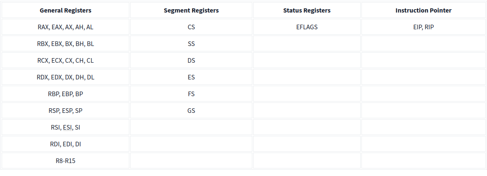

# CPU Register in x86 und x64

<strong>Instruction Pointer (Befehlspointer)</strong>
<ul>
<li><strong>x86: EIP (Extended Instruction Pointer)</strong></li>
<ul>
<li>32-bit Register</li>
<li>Zeigt auf die nächste auszuführende Anweisung</li>
</ul>
<li><strong>x64: RIP (Register Instruction Pointer)</strong></li>
<ul>
<li>64-bit Register</li>
<li>Erweitert für 64-bit Adressierung</li>
</ul>
</ul>

<strong>General-Purpose Registers (Allgemeine Register)</strong>
<ul>
<li><strong>EAX / RAX (Accumulator)</strong></li>
<ul>
<li><strong>x86: EAX</strong></li>
<ul>
<li>32-bit Register</li>
<li>Speichert Ergebnisse von arithmetischen Operationen</li>
<li>Zugriffsmodi: 16-bit (AX), 8-bit (AH/AL)</li>
</ul>
<li><strong>x64: RAX</strong></li>
<ul>
<li>64-bit Register</li>
<li>Entspricht EAX, aber mit erweiterter Größe</li>
</ul>
</ul>
<li><strong>EBX / RBX (Base Register)</strong></li>
<ul>
<li><strong>x86: EBX</strong></li>
<ul>
<li>32-bit Register</li>
<li>Häufig für Basisadressen verwendet</li>
<li>Zugriffsmodi: 16-bit (BX), 8-bit (BH/BL)</li>
</ul>
<li><strong>x64: RBX</strong></li>
<ul>
<li>64-bit Register</li>
<li>Entspricht EBX, aber mit erweiterter Größe</li>
</ul>
</ul>
<li><strong>ECX / RCX (Counter Register)</strong></li>
<ul>
<li><strong>x86: ECX</strong></li>
<ul>
<li>32-bit Register</li>
<li>Wird oft für Schleifenzähler verwendet</li>
<li>Zugriffsmodi: 16-bit (CX), 8-bit (CH/CL)</li>
</ul>
<li><strong>x64: RCX</strong></li>
<ul>
<li>64-bit Register</li>
<li>Entspricht ECX, aber mit erweiterter Größe</li>
</ul>
</ul>
<li><strong>EDX / RDX (Data Register)</strong></li>
<ul>
<li><strong>x86: EDX</strong></li>
<ul>
<li>32-bit Register</li>
<li>Häufig in Multiplikations- und Divisionsoperationen verwendet</li>
<li>Zugriffsmodi: 16-bit (DX), 8-bit (DH/DL)</li>
</ul>
<li><strong>x64: RDX</strong></li>
<ul>
<li>64-bit Register</li>
<li>Entspricht EDX, aber mit erweiterter Größe</li>
</ul>
</ul>
<li><strong>ESP / RSP (Stack Pointer)</strong></li>
<ul>
<li><strong>x86: ESP</strong></li>
<ul>
<li>32-bit Register</li>
<li>Zeigt auf den obersten Wert des Stacks</li>
</ul>
<li><strong>x64: RSP</strong></li>
<ul>
<li>64-bit Register</li>
<li>Entspricht ESP, aber für 64-bit Adressierung</li>
</ul>
</ul>
<li><strong>EBP / RBP (Base Pointer)</strong></li>
<ul>
<li><strong>x86: EBP</strong></li>
<ul>
<li>32-bit Register</li>
<li>Wird oft verwendet, um auf Funktionsparameter zuzugreifen</li>
</ul>
<li><strong>x64: RBP</strong></li>
<ul>
<li>64-bit Register</li>
<li>Entspricht EBP, aber mit erweiterter Größe</li>
</ul>
</ul>
<li><strong>ESI / RSI (Source Index)</strong></li>
<ul>
<li><strong>x86: ESI</strong></li>
<ul>
<li>32-bit Register</li>
<li>Für String-Operationen und als Offset verwendet</li>
</ul>
<li><strong>x64: RSI</strong></li>
<ul>
<li>64-bit Register</li>
<li>Entspricht ESI, aber mit erweiterter Größe</li>
</ul>
</ul>
<li><strong>EDI / RDI (Destination Index)</strong></li>
<ul>
<li><strong>x86: EDI</strong></li>
<ul>
<li>32-bit Register</li>
<li>Wird für Zieladressen bei String-Operationen verwendet</li>
</ul>
<li><strong>x64: RDI</strong></li>
<ul>
<li>64-bit Register</li>
<li>Entspricht EDI, aber mit erweiterter Größe</li>
</ul>
</ul>
<li><strong>R8-R15 (Zusätzliche Register in x64)</strong></li>
<ul>
<li>Nur in x64:</li>
<ul>
<li>64-bit Register, nicht vorhanden in 32-bit Systemen</li>
<li>Zugriffsmodi: 32-bit (R8D-R15D), 16-bit (R8W-R15W), 8-bit (R8B-R15B)</li>
</ul>
</ul>
</ul>

<strong>Status Flag Registers (Statusregister)</strong>
<ul>
<li>Enthalten verschiedene Flags, die den Zustand des Prozessors nach Operationen anzeigen, wie z.B. Zero Flag (ZF), Carry Flag (CF).</li>
</ul>

<strong>Segment Registers (Segmentregister)</strong>
<ul>
<li>Verwendet, um Speichersegmente zu adressieren.</li>
<li>Beispiele: CS (Code Segment), DS (Data Segment), SS (Stack Segment).</li>
</ul>

    <strong>Status-Flag-Register</strong>
    <ul>
        <li><strong>EFLAGS/RFLAGS</strong>: 32-Bit-Register in 32-Bit-Systemen, 64-Bit-Register in 64-Bit-Systemen.</li>
        <li><strong>Zero Flag (ZF)</strong>: Zeigt an, wenn das Ergebnis der letzten Instruktion Null war. (ZF = 1 bei Ergebnis 0)</li>
        <li><strong>Carry Flag (CF)</strong>: Zeigt an, wenn die letzte Instruktion zu einem Überlauf oder Unterlauf geführt hat. (CF = 1 bei Überlauf)</li>
        <li><strong>Sign Flag (SF)</strong>: Zeigt an, ob das Ergebnis negativ ist oder das höchstwertige Bit gesetzt ist. (SF = 1 bei negativem Ergebnis)</li>
        <li><strong>Trap Flag (TF)</strong>: Aktiviert den Debugging-Modus, bei dem die CPU eine Instruktion nach der anderen ausführt. (Nützlich zum Debuggen)</li>
    </ul>
    

    
    

    

    <strong>Segment-Register</strong>
    <ul>
        <li><strong>Code Segment (CS)</strong>: Zeigt auf den Code-Bereich im Speicher.</li>
        <li><strong>Data Segment (DS)</strong>: Zeigt auf den Datenbereich des Programms im Speicher.</li>
        <li><strong>Stack Segment (SS)</strong>: Zeigt auf den Stack des Programms im Speicher.</li>
        <li><strong>Extra Segments (ES, FS, GS)</strong>: Zeigen auf zusätzliche Datenbereiche und teilen den Speicher des Programms in vier verschiedene Datenabschnitte ein.</li>
    </ul>
    

