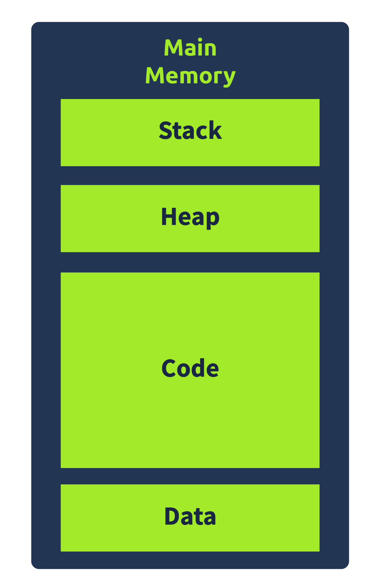

# CPU Register in x86 und x64

# CPU-Register Übersicht

## Register-Typen

- **Instruction Pointer (IP / EIP / RIP)**
  - Enthält die Adresse der nächsten auszuführenden Anweisung
  - Ursprünglich 16-Bit (Intel 8086), 32-Bit (EIP) in 32-Bit-Systemen, 64-Bit (RIP) in 64-Bit-Systemen

- **General-Purpose Registers (Allgemeine Register)**
  - 32-Bit-Register in x86-Systemen, 64-Bit-Register in 64-Bit-Systemen
  - **EAX / RAX**: Accumulator Register, speichert Ergebnisse arithmetischer Operationen
    - 16-Bit: AX, 8-Bit: AL (niedrig), AH (hoch)
  - **EBX / RBX**: Base Register, speichert Basisadresse für Offset-Referenzierung
    - 16-Bit: BX, 8-Bit: BH (hoch), BL (niedrig)
  - **ECX / RCX**: Counter Register, verwendet für Zähloperationen (z.B. Schleifen)
    - 16-Bit: CX, 8-Bit: CH (hoch), CL (niedrig)
  - **EDX / RDX**: Data Register, verwendet für Multiplikations- und Divisionsoperationen
    - 16-Bit: DX, 8-Bit: DH (hoch), DL (niedrig)
  - **ESP / RSP**: Stack Pointer, zeigt auf den Stack-Topp
    - 32-Bit (ESP), 64-Bit (RSP)
  - **EBP / RBP**: Base Pointer, greift auf Parameter im Stack zu
    - 32-Bit (EBP), 64-Bit (RBP)
  - **ESI / RSI**: Source Index Register, verwendet für String-Operationen
    - 32-Bit (ESI), 64-Bit (RSI)
  - **EDI / RDI**: Destination Index Register, verwendet für String-Operationen
    - 32-Bit (EDI), 64-Bit (RDI)
  - **R8-R15**: 64-Bit-Register, nur in 64-Bit-Systemen vorhanden
    - 32-Bit: R8D, 16-Bit: R8W, 8-Bit: R8B

    

## Hinweise

- **Suffixe für Adressierung:** D = Double-word, W = Word, B = Byte

    <strong>Status-Flag-Register</strong>
    <ul>
        <li><strong>EFLAGS/RFLAGS</strong>: 32-Bit-Register in 32-Bit-Systemen, 64-Bit-Register in 64-Bit-Systemen.</li>
        <li><strong>Zero Flag (ZF)</strong>: Zeigt an, wenn das Ergebnis der letzten Instruktion Null war. (ZF = 1 bei Ergebnis 0)</li>
        <li><strong>Carry Flag (CF)</strong>: Zeigt an, wenn die letzte Instruktion zu einem Überlauf oder Unterlauf geführt hat. (CF = 1 bei Überlauf)</li>
        <li><strong>Sign Flag (SF)</strong>: Zeigt an, ob das Ergebnis negativ ist oder das höchstwertige Bit gesetzt ist. (SF = 1 bei negativem Ergebnis)</li>
        <li><strong>Trap Flag (TF)</strong>: Aktiviert den Debugging-Modus, bei dem die CPU eine Instruktion nach der anderen ausführt. (Nützlich zum Debuggen)</li>
    </ul>
    

    
    

    

    <strong>Segment-Register</strong>
    <ul>
        <li><strong>Code Segment (CS)</strong>: Zeigt auf den Code-Bereich im Speicher.</li>
        <li><strong>Data Segment (DS)</strong>: Zeigt auf den Datenbereich des Programms im Speicher.</li>
        <li><strong>Stack Segment (SS)</strong>: Zeigt auf den Stack des Programms im Speicher.</li>
        <li><strong>Extra Segments (ES, FS, GS)</strong>: Zeigen auf zusätzliche Datenbereiche und teilen den Speicher des Programms in vier verschiedene Datenabschnitte ein.</li>
    </ul>
    

# Speicherlayout eines Programms in Windows

## Überblick

- **Abstraktion des Speichers**
  - Programme sehen eine abstrahierte Sicht des Speichers
  - Zugriff auf den gesamten Speicher ist nicht möglich, nur auf den eigenen Bereich
  - Details der Abstraktion werden hier nicht behandelt

- **Typisches Speicherlayout**
  - Speicher ist in verschiedene Sektionen unterteilt: Stack, Heap, Code und Data
  - Die Reihenfolge kann variieren (z.B. Code kann unter Data liegen)

## Sektionen im Speicher

- **Code**
  - Enthält den Programmcode (Text-Sektion in einer Portable Executable Datei)
  - Hat Ausführungsrechte; CPU kann die Daten in diesem Abschnitt ausführen

- **Data**
  - Beinhaltet initialisierte, konstante Daten (Global-Variablen und andere unveränderliche Daten)
  - Referenziert die Daten-Sektion in einer Portable Executable Datei

- **Heap**
  - Auch als dynamischer Speicher bekannt
  - Beinhaltet Variablen und Daten, die während der Programmausführung erstellt und gelöscht werden
  - Speicher wird zur Laufzeit zugewiesen und freigegeben

- **Stack**
  - Enthält lokale Variablen, übergebene Argumente und Rücksprungadressen
  - Wichtiger Bereich für Malware-Analyse, da hier oft die Kontrolle durch Malware übernommen wird
  - Details zu Buffer Overflows und Stack-Schutz werden in späteren Aufgaben behandelt

